# LoadBalancer_Solution_With_Apache_101_103
# Project Setup Guide

The steps involved in setting up a load-balanced Apache environment using Amazon EC2 instances are metioned below.
## Target Architecture
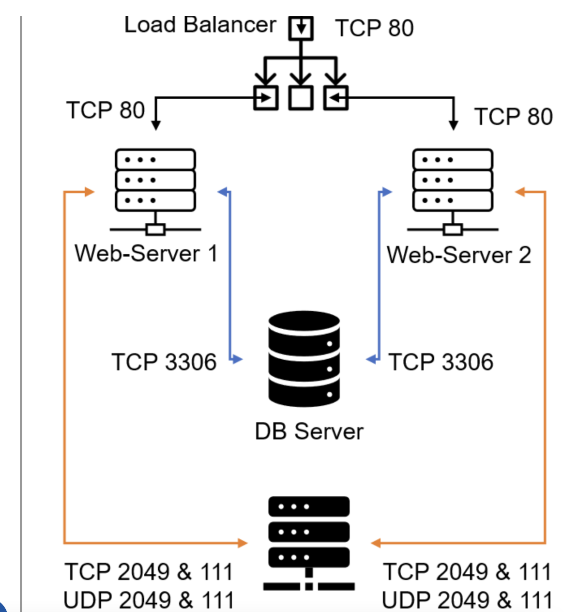

## Prerequisites

Before starting the setup, ensure the following components are correctly configured from a previous project:

- **Two RHEL Web Servers**: Running Apache (httpd)
- **One MySQL DB Server**: Hosted on Ubuntu 20.04
- **One RHEL NFS Server**: NFS properly configured and serving the `/var/www` directories mounted on `/mnt/maps`
- **Network Configuration**: Necessary TCP/UDP ports are opened for web, database, and NFS traffic. Clients can access both web servers via public IP addresses or DNS names.


## Steps to Configure Apache as a Load Balancer

### 1. EC2 Instance Creation

Created an ec2 instance named it as 'Project-8-apache-lb' in a region "Mumbai" with instance type "t2.micro", AMI (Amazon Machine Image ) as **Ubuntu Server 24.04**, at first created security group having inbound rules for (SSH),Http and Https.
- Private key was generated and named it as : "tooling_private_key" and downloaded ".pem" file.
- Ensured the instance is added to your existing list of EC2 instances.
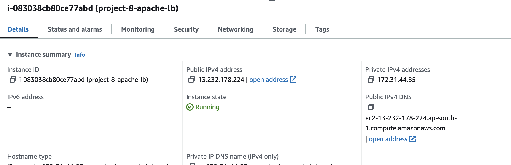

### 2. Configure Security Group

- Modify the security group associated with `Project-8-apache-lb` to allow incoming traffic.
- **Open TCP port 80**: This is essential for handling incoming HTTP traffic to the load balancer.
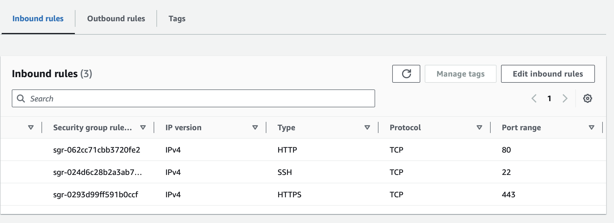
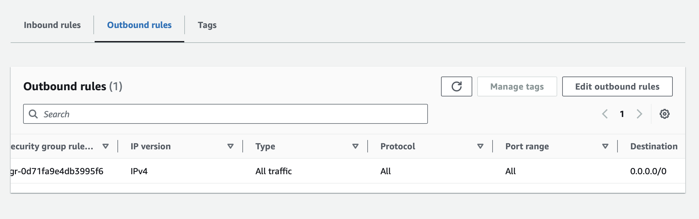
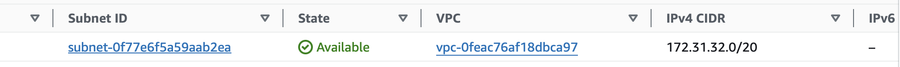


### 3. Install and Configure Apache Load Balancer:

- Begin by updating the package repository information on your EC2 instance:
    ```
    sudo apt-get update
    ```
- Install the Apache2 package:
    ```
    sudo apt-get install apache2
    ```
    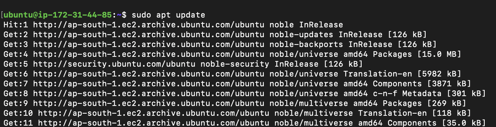
    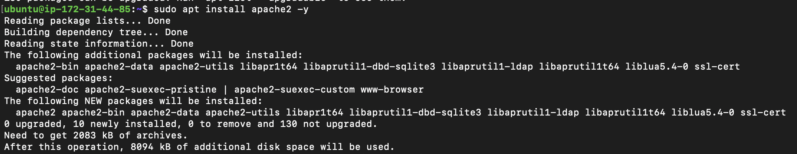
    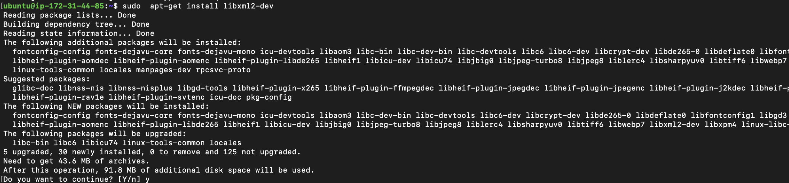

- Enable Required Modules:
To customize Apache to work as a load balancer, enable the necessary proxy modules with the following commands:
    ```
    sudo a2enmod rewrite
    sudo a2enmod proxy
    sudo a2enmod proxy_http
    sudo a2enmod proxy_balancer
    sudo a2enmod headers
    sudo a2enmod lbmethod_bytraffic
    ```
     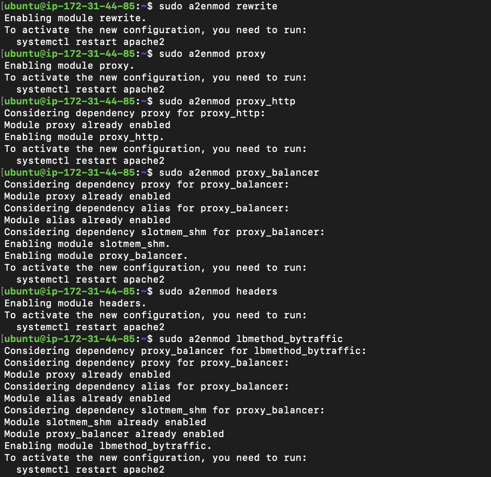


- After enabling the modules, restart Apache to apply the changes:
    ```
    sudo systemctl restart apache2
    ```

### Configure the Proxy Balancer:

- Open the default Apache configuration file or create a new configuration file under the sites-available directory:
    ```
    sudo nano /etc/apache2/sites-available/000-default.con
    ```

- Add this configuration into this section <VirtualHost *:80></VirtualHost>:
    ```
    <Proxy "balancer://mycluster">
        BalancerMember http://<WebServer1-Private-IP-Address>:80 loadfactor=5 timeout=1
        BalancerMember http://<WebServer2-Private-IP-Address>:80 loadfactor=5 timeout=1
        ProxySet lbmethod=bytraffic
        # ProxySet lbmethod=byrequests
    </Proxy>
    ```
    Save the file and close the editor.
    

### Validate and Restart Apache:

- After making the above changes, check the Apache configuration for any syntax errors:
    ```
    sudo apache2ctl configtest
    ```
- If you get a message saying "Syntax OK", proceed to reload Apache to apply the configuration changes:
    ```
    sudo systemctl reload apache2
    ```

### Testing the Load Balancer:

- To verify that your load balancer configuration works, try to access your load balancer's public IP address or Public DNS name from your web browser:
    ```
    http://<Load-Balancer-Public-IP-Address-or-Public-DNS-Name>/index.php
    ```
### Unmount Previous Projects 
- If in the previous project you mounted /var/log/httpd/ from your Web Servers to the NFS server, unmount them and ensure that each Web Server has its own log directory.

### Monitor Access Logs:

- Open two ssh/PuTTY consoles for both Web Servers and execute the following command in each to continuously monitor the access logs:
    ```
    sudo tail -f /var/log/httpd/access_log
    ```
    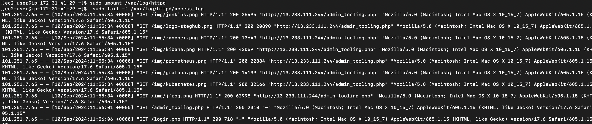

### Refresh your browser page multiple times using:
```
    http://<Load-Balancer-Public-IP-Address-or-Public-DNS-Name>/index.php
```
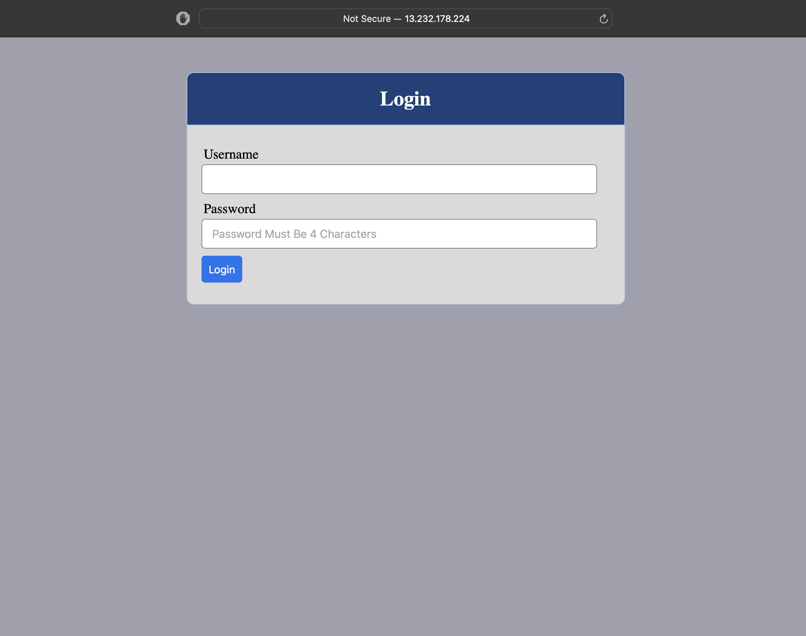

- Ensure that both servers receive HTTP GET requests from your load balancer. New records must appear in each server's log file, indicating that the traffic is being distributed evenly between the servers. The number of requests to each server should be similar since the loadfactor is set the same for both servers.

### Conclusion :

If you have configured everything correctly, your users will not even notice that their requests are being served by more than one server, as the traffic distribution will be seamless and efficient.


## Configuring local DNS names resolution:
- Open the Hosts File on Your Load Balancer Server:

    ```
    sudo vi /etc/hosts to open 
    ```
    

- Add DNS Entries to the Hosts File:

- Insert two records into the hosts file, each mapping a private IP address of a web server to an arbitrary local domain name. 
    ```
    <WebServer1-Private-IP-Address> Web1
    <WebServer2-Private-IP-Address> Web2
    ```

### Update Your Load Balancer Configuration:

- Modify your load balancer's configuration file to use the domain names instead of IP addresses. The entries in the load balancer configuration file should look like:
    ```
    BalancerMember http://Web1:80 loadfactor=5 timeout=1
    BalancerMember http://Web2:80 loadfactor=5 timeout=1
    ```
### Test the Configuration:

- Perform tests by using curl commands to access your web servers through the load balancer using the newly configured domain names. Use:-
    ```
    curl http://Web1
    curl http://Web2
    ```
    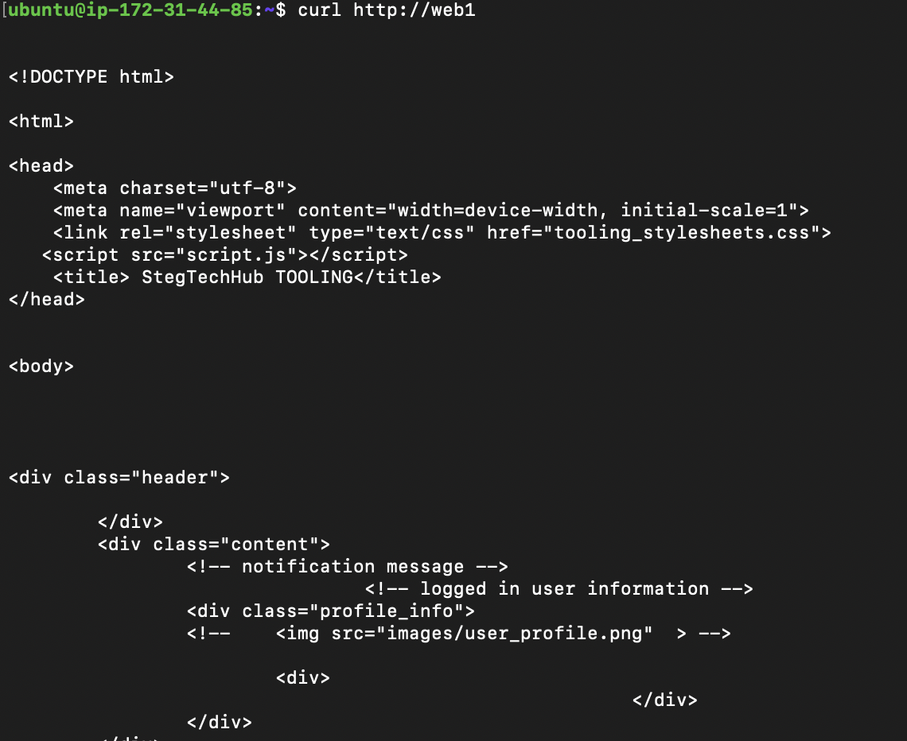
    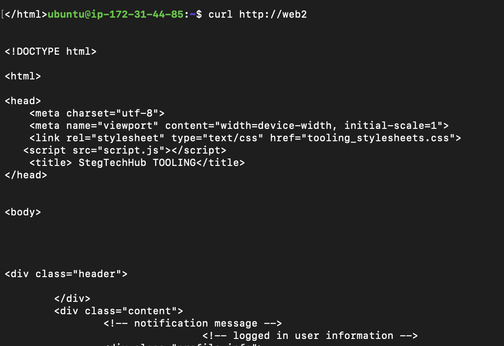
- These commands should successfully return responses from the web servers if the configuration is correct.

### Consider Limitations:

- Remember that this setup, using the /etc/hosts file, is only a local configuration limited to the load balancer server. The domain names Web1 and Web2 won't be resolvable from other servers internally or from the Internet.

